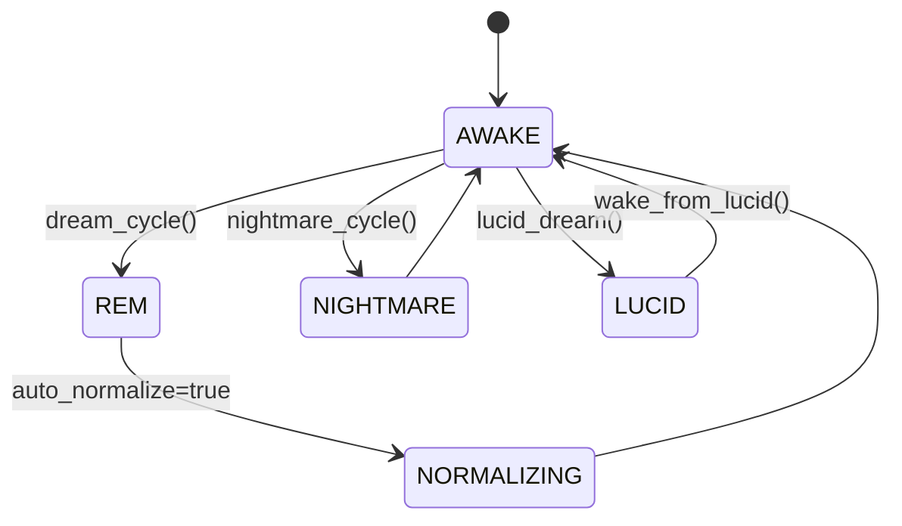

# DreamGraph v5.0 Cognitive Engine

> *"The graph dreams, forgets, and learns."*

The Cognitive Engine is the heart of DreamGraph's autonomous learning system. It operates as a stateful cognitive loop that continuously analyzes the knowledge graph, generates hypotheses, validates them, and maintains architectural memory over time.

---

## Core Principles

### 1. Speculation is isolated from fact
Dreams (hypotheses) are generated in a separate dream graph and must pass the **Truth Filter** before promotion to the validated fact graph. Speculation never mutates truth directly.

### 2. Memory decays unless reinforced
Unvalidated ideas fade over time. Reinforced or validated insights become persistent architectural memory.

### 3. Tensions surface unresolved risk
The engine continuously tracks tensions — contradictions, weak assumptions, risky patterns, and architectural drift.

### 4. Cycles create convergence
Repeated dream → normalize → validate loops improve graph accuracy and system understanding.

---

## Cognitive State Machine

DreamGraph operates as a five-state machine:



### States

| State | Purpose |
|---|---|
| **AWAKE** | Normal operating mode. Fact graph is stable and queryable. |
| **REM** | Speculative dream generation. Hypotheses are created but not yet trusted. |
| **NORMALIZING** | Truth Filter evaluates dream candidates and promotes / rejects / retains as latent. |
| **NIGHTMARE** | Adversarial scan mode for threats, vulnerabilities, and anti-patterns. |
| **LUCID** | Interactive human-guided hypothesis exploration. |

---

## Dream Pipeline

### 1. Dream generation
The engine analyzes graph structure, source signals, and optionally LLM output to produce candidate edges, tensions, or missing abstractions.

### 2. Normalization
Dream candidates are scored using structural evidence, recurrence, signal quality, and confidence. Outcomes:

- **validated** → promoted to fact graph
- **latent** → kept as speculative memory
- **rejected** → discarded

### 3. Decay
Unreinforced dreams and stale tensions decay or expire over time. As of v8.2.6:

- **Rejected edges and nodes** decay at **2× the normal rate** and bypass the tension-protection halving so they leave the dream graph quickly. Reinforcement is **disabled** for rejected memory — a strategy that keeps re-deriving the same rejected hypothesis can no longer pump its confidence back up.
- **Latent edges and nodes** use a **diminishing-returns reinforcement curve**: each subsequent re-derivation contributes a smaller bump (`bump = candidate.confidence * 0.3 / (1 + reinforcement_count * 0.1)`), so confidence cannot saturate at 1.0 from same-strategy re-derivation alone.

### 4. Promotion and memory
Validated edges become part of long-term architectural understanding and can influence future reasoning, documentation, and remediation planning.

---

## Canonical Promotion Provenance

Validated dream nodes are not promoted into the fact graph (`features.json`, `workflows.json`, `data_model.json`) unless they have a defensible provenance path. Self-consistent fictional clusters — for example a tight ring of hubs that all reference each other but no real source code — are blocked at the gate. The check is project-agnostic; it does not assume DreamGraph internals or any specific managed-project structure.

Every promoted entity carries a `provenance_kind` field:

| Kind | Required evidence |
|---|---|
| `source_backed` | `source_repo` is set, and at least one entry in `source_files`. |
| `human_asserted` | `source_repo` is set, and `human_asserted: true` (or `provenance_kind: "human_asserted"`). |
| `derived_hub` | `source_repo` is set, and every id in `derived_from_node_ids` is itself grounded. Grounding is computed to a fixed point so hub → hub chains survive when their ends ultimately reach `source_backed` or `human_asserted` nodes. |

When a dream node lacks an explicit `source_repo` but every grounded support points at the same single repo, that repo is inferred. Dreams that fail every rule are left in the dream graph (so they remain visible) but never become facts.

### Source-less fact quarantine

The MCP tool `quarantine_source_less_facts` enforces the same invariant retroactively against an instance that was polluted before the gate was added. It:

1. Computes the grounded canonical id set using the same fixed-point algorithm.
2. Quarantines every ungrounded canonical entity, then cascades to dream nodes that touch or depend on them, their dream edges, validated edges, candidate results, and both active and resolved tensions.
3. Writes a full `source_less_fact_quarantine_<ISO-ts>.json` audit report **before** mutating any seed file.
4. Rewrites `features.json`, `workflows.json`, `data_model.json`, dream graph, candidates, validated edges, tensions, and `index.json` (the UI elements added in slice 1 are re-included).

The tool requires `confirm: true` and is classified as `internal-only` in the discipline manifest.

---

## Dream Strategies

DreamGraph supports multiple dream-generation strategies.

| Strategy | Purpose |
|---|---|
| `llm_dream` | LLM-generated high-level architectural hypotheses |
| `gap_detection` | Finds related entities that should likely be connected |
| `weak_reinforcement` | Strengthens weak but recurring signals |
| `cross_domain` | Bridges disconnected domains |
| `missing_abstraction` | Proposes unifying abstractions or higher-level concepts |
| `symmetry_completion` | Adds likely reverse / mirrored relationships |
| `tension_directed` | Focuses dreaming around unresolved tensions |
| `causal_replay` | Mines historical cause → effect chains |
| `reflective` | Agent-driven insight capture after code reading |
| `orphan_bridging` | Attaches degree-0 fact-graph entities to nearest plausible neighbor using relaxed signals (capped per cycle by `DG_ORPHAN_BUDGET`, default 20). Adds a +0.15 score bonus when both endpoints transitively touch the same datastore. |
| `pgo_wave` | Stochastic Lévy-flight divergence — long-range reseeding of the dream search distribution |
| `schema_grounding` | Uses scanned datastore tables (`scan_database`) to (1) propose `stored_in` edges from `data_model` entities to their datastore (exact match conf 0.85, fuzzy 0.55), (2) propose `shares_state_with` edges between top-level entities in different repos that resolve to the same datastore, and (3) raise `phantom_entity` / `shadow_table` tensions. Inert when no datastores are configured or no scan has run. |
| `all` | Runs the full strategy set |

---

## Truth Filter

The Truth Filter decides what becomes fact.

### Inputs to scoring

- dream confidence
- reinforcement count
- recurrence across cycles
- graph topology support
- cross-signal evidence
- contradiction pressure

### Typical outcomes

| Outcome | Meaning |
|---|---|
| **validated** | Strong enough to promote into fact graph |
| **latent** | Plausible but not yet proven |
| **rejected** | Too weak, contradictory, or low-value |
| **expired** | Decayed after insufficient reinforcement |

The promotion threshold is configurable in the cognitive engine policy profile.

---

## Tensions

Tensions are durable records of unresolved architectural issues.

Examples:

- a workflow that spans features with unclear ownership
- duplicated logic across modules
- likely missing abstraction
- inconsistent validation behavior
- threat or compliance concerns

Tensions can be:
- created by dream cycles
- created by reflective code reading
- resolved by humans or the system
- revisited if contradictory evidence reappears

### Tension Resolution Lifecycle

Every `dream_cycle` invokes a two-stage resolver after normalization:

1. **Proposer pass** (`runTensionResolverCycle`) — selects up to 5 unresolved tensions that have neither a pending resolution candidate nor a prior failed attempt, sorted by urgency. Each selected tension receives a candidate via, in order of preference:
   1. **LLM proposer** — active whenever LLM readiness is `ready`. The normalizer model is asked for `{strategy, rationale, validation_window}` in strict JSON mode.
   2. **Intervention bridge** (v8.2.6) — reuses the remediation planner (`strategyForTension`) so the candidate is grounded in the data-model:
      - any participant entity missing from `data_model.json` → `wont_fix` plan,
      - both entities exist but no relationship/link → `merge` strategy with a pre-built `enrich_seed_data` payload attached as `proposed_action`,
      - source-level mismatches → `mediator` (missing/weak link) or `split` (code insight).
   3. **Keyword heuristic** — final fallback if the planner cannot build a context.

   Each candidate carries `{ strategy, rationale, proposed_at, validation_window, source, proposed_action? }`. The default validation window is 3 dream cycles.

   When `DREAMGRAPH_AUTO_APPLY_RESOLUTION_PLANS=1` is set, candidates whose `proposed_action.tool === "enrich_seed_data"` are executed immediately so the new edge can be observed by the next cycle's validation pass.

2. **Validation pass** (`validateResolutionCandidates`) — decrements `validation_window` for every open candidate and inspects the validated edges between the tension's entities:
   - **Fresh** bridging edge present (`validated_at >= proposed_at - 1s`) + window expired → `resolveTension(system, confirmed_fixed)` with the bridge as evidence. Pre-existing bridges no longer count as confirmation.
   - No fresh bridge + window expired + strategy `wont_fix` → `resolveTension(system, wont_fix)`.
   - No fresh bridge + window expired + any other strategy → escalate: bump urgency by 0.05 (capped at 1.0), set `attempted=true`, clear the candidate so future cycles can retry with a different strategy.
   - Window > 0 → leave as awaiting.

Resolver activity is summarized in the `dream_cycle` return string (now including `auto_applied`) and surfaced in `cognitive_status` under `tensionStats.resolution_pipeline` (`pending_candidates`, `awaiting_validation`, `by_strategy`). The pipeline field is omitted when there is no active candidate.

---

## Self-Healing Graph Integrity

Added in v8.2.6. The fact graph used to accumulate **orphans** (degree-0 entities), **dangling link targets** (`A → B` where `B` does not exist as a node), and **asymmetric edges** (`A → B` with no reciprocal `B → A`) every time a new entity was created. Cleanup was always manual.

Four entry points now run self-healing passes automatically:

| Entry point | Pass(es) |
|---|---|
| `dream_cycle` (when promotions occurred) | `autoWireOrphans()` (LLM-driven `wire_links`, capped at 25) → `applyBidirectionalBacklinks()` |
| `enrich_seed_data` (after successful insert/update) | `applyBidirectionalBacklinks()` |
| `scan_project` (end of `runScanProject`, when real seeds were written) | `applyBidirectionalBacklinks()` |
| `init_graph` (before final `success` return) | `applyBidirectionalBacklinks()` |

Implementation lives in [src/tools/graph-integrity.ts](../src/tools/graph-integrity.ts):

- **`applyBidirectionalBacklinks()`** — pure-data, idempotent. For every fact-graph link `A → B` whose target `B` is also a fact-graph entity, ensures `B.links` contains a reciprocal `B → A` with an inverted relationship label (`depends_on ↔ supports`, `contains ↔ part_of`, etc.). Writes go through `executeEnrichSeedData` in merge mode with a new internal `_skipIntegrityHooks: true` flag that prevents recursion.
- **`autoWireOrphans()`** — wraps `executeWireLinksProgrammatic` from [src/tools/wire-links.ts](../src/tools/wire-links.ts). No-op when no LLM is configured.

All hooks are best-effort: failures are logged but never abort the host operation. Diagnostics are available via the `scripts/audit-orphans.mjs` and `scripts/add-backlinks.mjs` utilities.

---

## Autonomous Parser-Node Enrichment (v10.1)

`scan_project` discovers entities through deterministic native extractors. The
resulting graph is **structurally complete** (correct identity, source paths,
basic relationships) but **semantically thin**: descriptions are formulaic
("Class `Foo` in `bar.cpp`"), `intent` and `purpose` are absent, and most
parser-discovered nodes have no `feature_anchors` — they are orphans with
generic names.

`enrich_parser_nodes` closes that gap in one autonomous batch pass:

- **Eligibility** is intrinsic to the data: an entity is eligible when
  `provenance.scanner === "native"` and `enrichment.enriched !== true`. No
  per-call hand-curation is required.
- **Bucketing** by `repo + domain` keeps the LLM's context coherent so anchors
  reference real siblings, not hallucinated ids.
- **Anchor validation** is provider-agnostic: any `feature_anchors[].target_id`
  not in the known feature id set is dropped silently, never written. Anchors
  are persisted as **weak `GraphLink`s** so they can be promoted or rejected
  by normal cognitive cycles.
- **Per-batch persistence** is atomic (`atomicWriteFile` + `invalidateCache`)
  so partial progress always survives a crash or interruption.
- **Replaces hand-looping `enrich_seed_data`.** The Architect calls this tool
  once after `scan_project`; previous workflows that issued one
  `enrich_seed_data` per missing node are deprecated for the bulk path
  (`enrich_seed_data` remains for targeted, hand-authored payloads).

The output is a single result object aggregating eligibility counts, batches
run, LLM calls and tokens, anchors written, and any per-batch errors — a
report the agent can reason about directly without re-querying the graph.

---

## Normalizer and Dreamer Separation

The cognitive engine supports separate LLM tuning for:

- **Dreamer** — creative hypothesis generation
- **Normalizer** — lower-temperature validation and truth filtering

This separation is useful because:
- dream generation benefits from broader creativity
- normalization benefits from stricter consistency and lower variance

---

## Configuration

LLM settings are configured via environment variables or per-instance `config/engine.env` files:

| Variable | Default | Description |
|----------|---------|-------------|
| `DREAMGRAPH_LLM_PROVIDER` | `ollama` | Provider type: `ollama`, `lmstudio`, `openai`, `anthropic`, `sampling`, `none` |
| `DREAMGRAPH_LLM_MODEL` | `qwen3:8b` | Base model name used unless Dreamer/Normalizer overrides are set |
| `DREAMGRAPH_LLM_URL` | `http://localhost:11434` | API base URL |
| `DREAMGRAPH_LLM_API_KEY` | — | API key (required for `openai` and `anthropic` providers) |
| `DREAMGRAPH_LLM_TEMPERATURE` | `0.7` | Base creativity parameter (0.0–1.0) |
| `DREAMGRAPH_LLM_MAX_TOKENS` | `2048` | Base max response tokens |
| `DREAMGRAPH_LLM_DREAMER_MODEL` | *(base model)* | Override model for Dreamer component |
| `DREAMGRAPH_LLM_DREAMER_TEMPERATURE` | *(base temp)* | Override temperature for Dreamer |
| `DREAMGRAPH_LLM_DREAMER_MAX_TOKENS` | *(base tokens)* | Override max tokens for Dreamer |
| `DREAMGRAPH_LLM_NORMALIZER_MODEL` | *(base model)* | Override model for Normalizer component |
| `DREAMGRAPH_LLM_NORMALIZER_TEMPERATURE` | `0.1` if unset | Override temperature for Normalizer |
| `DREAMGRAPH_LLM_NORMALIZER_MAX_TOKENS` | *(base tokens)* | Override max tokens for Normalizer |

### Per-Instance Configuration

Each instance can override the global LLM settings via a `config/engine.env` file. `dg init --template <name>` seeds this file from the selected template using this resolution order: `~/.dreamgraph/templates/<name>/config/engine.env` → repository `templates/<name>/config/engine.env` → in-code scaffold. Users can create additional named templates by copying `~/.dreamgraph/templates/default/` and renaming it, then selecting them with `dg init --template <name>`:

```text
~/.dreamgraph/<instance-uuid>/
└── config/
    ├── instance.json     # Identity
    ├── mcp.json          # Repos, transport
    ├── policies.json     # Discipline rules
    ├── schema_version.json
    └── engine.env        # LLM provider, API keys, dreamer/normalizer settings
```

Example `engine.env`:

```bash
DREAMGRAPH_LLM_PROVIDER=openai
DREAMGRAPH_LLM_URL=https://api.openai.com/v1
DREAMGRAPH_LLM_API_KEY=****
DREAMGRAPH_LLM_DREAMER_MODEL=gpt-4o-mini
DREAMGRAPH_LLM_DREAMER_TEMPERATURE=0.9
DREAMGRAPH_LLM_DREAMER_MAX_TOKENS=10240
DREAMGRAPH_LLM_NORMALIZER_MODEL=gpt-5.4-nano
DREAMGRAPH_LLM_NORMALIZER_TEMPERATURE=0.1
DREAMGRAPH_LLM_NORMALIZER_MAX_TOKENS=4096
```

The `engine.env` file uses simple `KEY=VALUE` syntax (supports comments with `#`, quoted values). Values are loaded at startup **before** config parsing, so they override global env vars with "per-instance wins" semantics. This allows different instances to use different models, providers, or API keys.

### Integration with the Dreamer

When `strategy="all"` is used (the default for scheduled dream cycles):

1. **LLM dream runs first** — allocated 40% of the total dream budget
2. **Structural strategies split the remaining 60%** — gap detection, weak reinforcement, etc.
3. **Normalization runs next** — validates or retains latent signals
4. **Tensions and narratives update** — the graph's memory evolves

---

## Nightmare Mode

`nightmare_cycle()` performs adversarial analysis against the fact graph.

Threat strategies include:

- privilege escalation
- data leak path
- injection surface
- missing validation
- broken access control

Nightmare findings are stored separately from validated facts and can be used to generate remediation plans.

---

## Lucid Dreaming

Lucid dreaming allows an operator to explore a hypothesis interactively.

Flow:

1. start a lucid session with a hypothesis
2. inspect supporting and contradicting signals
3. dig deeper, refine, dismiss, or accept signals
4. wake from lucid to persist accepted outcomes

This provides a human-in-the-loop path from speculation to institutional memory.

---

## Temporal and Causal Cognition

The engine can analyze its own history to infer:

- which tensions are rising or falling
- where changes propagate causally
- which areas repeatedly regress
- where future risk is likely to emerge

These analyses strengthen remediation planning and operational prioritization.

---

## Safety and Guard Rails

Key safety properties:

- REM does not write facts directly
- NIGHTMARE findings are isolated from the fact graph
- tension counts are capped
- stale speculative memory decays automatically
- normalization is threshold-gated
- discipline phases restrict sensitive tool usage

---

## Why this matters

The cognitive engine gives DreamGraph persistence of architectural understanding.

Instead of every session starting from zero, the system:

- remembers validated relationships
- forgets weak or stale speculation
- surfaces risk as tensions
- improves through repeated cycles
- keeps reasoning grounded in a durable graph rather than transient prompts
