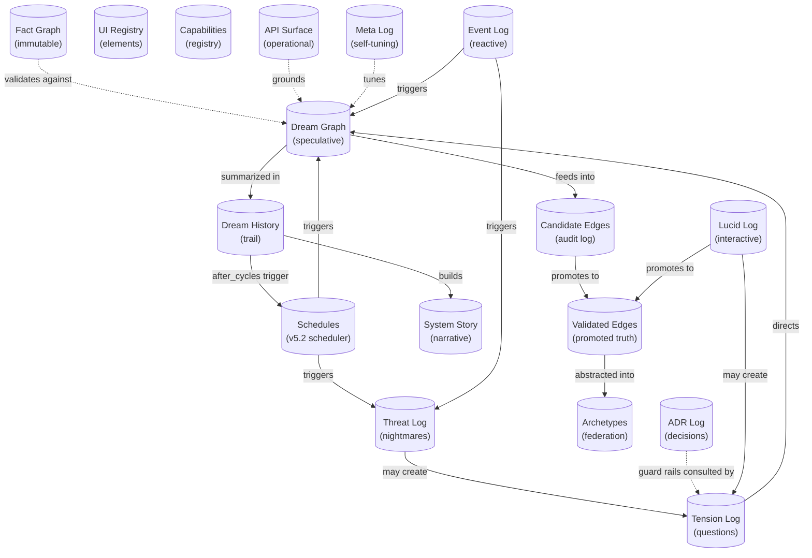

# DreamGraph Data Model

> All 20 data stores that make up DreamGraph's persistent state.

---

## Store Relationship Map

---

## Cognitive Stores

### Dream Graph (`dream_graph.json`)

The primary speculative memory store. Contains hypothetical nodes and edges generated during REM cycles.

**Behavior:** Grows during REM, shrinks during normalization and decay. Deduplication via normalized keys (sorted `from|to` + base relation).

| Field | Type | Description |
|-------|------|-------------|
| `nodes[]` | DreamNode[] | Hypothetical entity representations |
| `nodes[].id` | string | Entity name |
| `nodes[].hypothetical` | boolean | Always `true` |
| `nodes[].domain` | string | Inferred domain |
| `nodes[].confidence` | number | 0.0–1.0, decays each cycle |
| `nodes[].ttl` | number | Cycles until expiry (default 8) |
| `edges[]` | DreamEdge[] | Speculative relationships |
| `edges[].from` | string | Source entity ID |
| `edges[].to` | string | Target entity ID |
| `edges[].relation` | string | Relationship type (e.g. `may_depend_on`) |
| `edges[].confidence` | number | Combined score, decays by 0.05/cycle |
| `edges[].plausibility` | number | Domain coherence score |
| `edges[].evidence` | number | Grounding evidence score |
| `edges[].evidence_count` | number | Independent evidence sources |
| `edges[].contradiction` | number | Conflict score (max 0.3 for promotion) |
| `edges[].strategy` | string | Origin strategy |
| `edges[].ttl` | number | Cycles until expiry |
| `edges[].reinforcement_count` | number | Times re-generated (dedup counter) |
| `edges[].generated_at` | number | Cycle when first created |
| `edges[].status` | string | `candidate` \| `latent` \| `validated` \| `rejected` |

**Relationships:** Feeds into `candidate_edges_store`, promotes to `validated_edges_store`, validated against `fact_graph`.

---

### Candidate Edges (`candidate_edges.json`)

Append-only log of all normalization judgments. Never truncated — grows monotonically.

| Field | Type | Description |
|-------|------|-------------|
| `id` | string | Unique identifier |
| `from` | string | Source entity |
| `to` | string | Target entity |
| `relation` | string | Relationship type |
| `outcome` | string | `validated` \| `latent` \| `rejected` |
| `scores` | object | Full breakdown: plausibility, evidence, contradiction, confidence |
| `cycle` | number | Normalization cycle number |

---

### Validated Edges (`validated_edges.json`)

Edges that passed the promotion gate. Generally stable and growing.

**Promotion criteria:** confidence ≥ 0.62, plausibility ≥ 0.45, evidence ≥ 0.40, evidence_count ≥ 2, contradiction ≤ 0.3.

| Field | Type | Description |
|-------|------|-------------|
| `from` | string | Source entity |
| `to` | string | Target entity |
| `relation` | string | Cleaned relationship (no speculative qualifiers) |
| `confidence` | number | Combined confidence at promotion time |
| `promoted_at` | number | Cycle number |
| `strategy` | string | Original dream strategy |

---

### Tension Log (`tension_log.json`)

All tensions: unresolved questions, inconsistencies, discovered gaps. Active cap of **200** prevents cognitive overload while allowing rich autonomous exploration. Resolved tensions are archived, not deleted.

| Field | Type | Description |
|-------|------|-------------|
| `id` | string | UUID |
| `description` | string | Human-readable description |
| `type` | string | `missing_link` \| `weak_connection` \| `hard_query` \| `ungrounded_dream` \| `code_insight` |
| `urgency` | number | 0.0–1.0, decays by 0.01/cycle |
| `domain` | string | One of 11 domains: security, invoicing, sync, integration, data_model, auth, payroll, reporting, api, mobile, general |
| `entities` | string[] | Related entity IDs |
| `ttl` | number | Cycles until auto-expiry (default 30) |
| `created_at` | number | Cycle when recorded |
| `resolved` | boolean | Whether closed |
| `resolution.type` | string | `confirmed_fixed` \| `false_positive` \| `wont_fix` |
| `resolution.authority` | string | `human` \| `system` |
| `resolution.cycle` | number | When resolved |
| `attempted` | boolean | At least one resolution candidate has been validated and escalated. Prevents the resolver from re-proposing the same strategy on every cycle |
| `resolution_candidate` | object? | Pending resolution proposal awaiting validation. Removed when the tension resolves or after escalation |
| `resolution_candidate.strategy` | string | `merge` \| `mediator` \| `split` \| `reframe` \| `wont_fix` |
| `resolution_candidate.rationale` | string | Why this strategy was chosen |
| `resolution_candidate.proposed_at` | string | ISO timestamp of the proposer pass that created the candidate |
| `resolution_candidate.validation_window` | number | Dream cycles remaining before the candidate is judged. Decremented by `validateResolutionCandidates` each cycle |
| `resolution_candidate.source` | string | `heuristic` \| `llm` |
| `resolution_candidate.proposed_action` | object? | v8.2.6. Concrete follow-up: an `enrich_seed_data` payload (graph-enrichment plans) or a `resolve_tension` call (wont_fix / source-change plans). Auto-executed when `DREAMGRAPH_AUTO_APPLY_RESOLUTION_PLANS=1` |

---

### Explorer Audit Log (`explorer_audit.jsonl`)

JSONL append-only ledger of every curated mutation issued through the Explorer
SPA's `POST /explorer/mutations/{intent}` funnel. Slice 2 covers
`tension.resolve`, `candidate.promote`, and `candidate.reject`. **Every
mutation — successful, failed, or dry-run — produces exactly one row.** The
daemon emits an `audit.appended` event on the in-process bus immediately after
each append, which the EventDock surfaces in real time.

One row per line, JSON object:

| Field | Type | Description |
|-------|------|-------------|
| `mutation_id` | string | UUIDv4 generated server-side; returned to the caller |
| `timestamp` | string | ISO-8601 timestamp at append time |
| `actor` | string | Instance UUID of the caller (from `X-DreamGraph-Instance`) |
| `intent` | string | Wire name of the mutation (e.g. `tension.resolve`) |
| `affected_ids` | string[] | Entity / edge / tension ids the mutation touched |
| `reason` | string | Required non-empty justification supplied by the caller |
| `before_hash` | string \| null | sha-256 hex of the subject before the handler ran |
| `after_hash` | string \| null | sha-256 hex of the subject after; equals `before_hash` for dry-run |
| `etag` | string \| null | Snapshot etag observed *after* the mutation (for replay/audit) |
| `dry_run` | boolean | `true` when rehearsed via `X-DreamGraph-Dry-Run: 1` or `body.dry_run: true` |
| `ok` | boolean | Whether the mutation succeeded |
| `error` | string? | Short error code on failure (`etag_mismatch`, `not_found`, …) |
| `message` | string? | Human-readable error message on failure |

Preconditions enforced before any row is written:

- `If-Match` header is **mandatory** for the three real intents. Missing → 400 `missing_if_match`. Stale → 412 `etag_mismatch` (and a failure row is recorded).
- `body.reason` is **mandatory** and must be a non-empty string. Missing → 400 `missing_reason`.
- Auth must succeed (`X-DreamGraph-Instance` matches the active scope). 401/403 responses do **not** produce audit rows.

---

### Dream History (`dream_history.json`)

Append-only audit trail of every cycle. Never modified, only appended.

| Field | Type | Description |
|-------|------|-------------|
| `cycle` | number | Monotonically increasing |
| `phase` | string | `dream` \| `nightmare` |
| `dreams` | number | Edges generated |
| `promoted` | number | Edges promoted |
| `latent` | number | Edges kept as speculative memory |
| `rejected` | number | Edges discarded |
| `expired` | number | Edges decayed away |
| `strategies` | object | Strategy → count map |
| `tensions_active` | number | Active tension count at cycle end |
| `timestamp` | string | ISO timestamp |

---

### Threat Log (`threat_log.json`)

Output from NIGHTMARE adversarial scans.

| Field | Type | Description |
|-------|------|-------------|
| `from` | string | Attack surface / vulnerable component |
| `to` | string | Affected resource / data |
| `threat_type` | string | `privilege_escalation` \| `data_leak_path` \| `injection_surface` \| `missing_validation` \| `broken_access_control` |
| `severity` | string | `critical` \| `high` \| `medium` \| `low` |
| `cwe_id` | string | CWE identifier (e.g. CWE-269) |
| `description` | string | Threat description |
| `blast_radius` | string[] | Potentially affected entities |
| `cycle` | number | Discovery cycle |

---

### Archetypes (`dream_archetypes.json`)

Anonymized patterns for cross-project federation.

| Field | Type | Description |
|-------|------|-------------|
| `id` | string | Unique archetype ID |
| `pattern_type` | string | `security_pattern` \| `structural_gap` \| `cross_domain_bridge` \| `tension_resolution` \| `symmetry_pattern` \| `reinforcement_pattern` \| `causal_pattern` \| `generic_connection` |
| `from_role` | string | Anonymized source role (e.g. `auth_component`) |
| `to_role` | string | Anonymized target role |
| `relation` | string | Abstracted relationship |
| `confidence` | number | Confidence at extraction time |
| `source_system` | string | Anonymized origin identifier |

---

## Documentation Stores

### ADR Log (`adr_log.json`)

Append-only Architecture Decision Records.

| Field | Type | Description |
|-------|------|-------------|
| `id` | number | Sequential ADR number |
| `title` | string | Decision title |
| `status` | string | `accepted` \| `deprecated` \| `superseded` |
| `context` | string | Problem statement |
| `decision` | string | What was decided |
| `alternatives` | string[] | Considered alternatives |
| `consequences` | string[] | Known consequences |
| `guard_rails` | string[] | Constraints that must be preserved |
| `entities` | string[] | Related entity IDs |
| `tags` | string[] | Classification tags |
| `date` | string | ISO date |

---

### UI Registry (`ui_registry.json`)

Semantic UI element definitions across platforms. Supports merge-on-update and platform gap detection. As of **v10.2.0** UI elements are first-class graph citizens: entries with a non-empty `source_repo` are indexed in `index.json` alongside features/workflows/data_model and are eligible for autonomous LLM enrichment via `enrich_parser_nodes` (target `ui` / `all`). The `source_repo` field is the provenance gate — manual entries without `source_repo` remain in the registry but are intentionally excluded from the canonical graph index.

As of **v10.3.0** (slice 2) `ui_registry.json` is also populated by the native UI scanner: `scan_project target:"ui"` walks `.tsx/.jsx/.vue/.svelte/.razor/.xaml` files and inserts scanner-origin entries via `applyScannerUiElements`. The merge preserves entries with `source_kind` of `manual`, `sdk`, `user_guidance`, or `generated` (the scanner never overwrites them) and preserves enrichment fields on existing scanner-origin entries across re-scans.

| Field | Type | Description |
|-------|------|-------------|
| `id` | string | Unique element ID (kebab-case) |
| `name` | string | Display name |
| `category` | string | `data_display` \| `data_input` \| `navigation` \| `feedback` \| `layout` \| `action` \| `composite` |
| `purpose` | string | Semantic purpose (role tag — preserved across enrichment) |
| `features` | string[] | Related feature IDs |
| `data_contract` | object | Input/output/events specification |
| `interaction_model` | string[] | `hover` \| `click` \| `drag` \| `keyboard` \| `touch` \| `swipe` |
| `platforms` | object | `{ web: {...}, ios: {...}, android: {...} }` |
| `source_repo` | string? | Repository the element originated from. **Indexing/enrichment gate.** |
| `source_file` | string? | Path of the source file the element was extracted from. |
| `source_kind` | string? | `scanner` \| `manual` \| `sdk` \| `user_guidance` \| `generated`. Descriptive only. |
| `evidence_refs` | string[]? | Supporting file paths / anchors. |
| `intent` | string? | High-level intent (auto-populated by enrichment). |
| `description_raw` | string? | Original raw description prior to enrichment rewrite. |
| `enrichment` | object? | `{ enriched, enriched_at, enricher, model?, confidence? }` — same shape as features/data_model. |
| `links` | GraphLink[]? | Cross-graph links (`feature`, `workflow`, `data_model`, `capability`, `datastore`, `ui_element`). |

---

## Foundation Stores

### Fact Graph (`data/*.json`)

The immutable knowledge base — **never modified by the cognitive system**. Written only by the enrichment script or manual population.

| File | Content |
|------|---------|
| `system_overview.json` | Project description, architecture overview |
| `features.json` | Feature entities with cross-links (GraphLink[]) |
| `workflows.json` | Operational workflows with steps, triggers, actors |
| `data_model.json` | Data entity definitions with key fields, relationships |
| `auxiliary_entities.json` | Project entities discovered by `scan_project` that are *not* features/workflows/data_model: test suites, configuration files, automation scripts, registered MCP tools |
| `index.json` | Entity ID → resource URI lookup |

#### Enrichment fields (v10.1, extended in v10.2 to cover UI registry)

`Feature`, `DataModelEntity`, and (as of v10.2) `SemanticElement` (UI registry) entries support additive optional fields written by `enrich_parser_nodes`:

| Field | Type | Description |
|-------|------|-------------|
| `intent` | string? | Why the entity exists / problem it solves |
| `purpose` | string? | Short tag for primary role (e.g. `service-locator`, `configuration`). For UI elements this field is **preserved**, not overwritten — the UI's own purpose already serves as the role tag. |
| `description_raw` | string? | Original parser-generated description preserved before the LLM rewrote `description` |
| `enrichment.enriched` | boolean | `true` once enriched |
| `enrichment.enriched_at` | string | ISO timestamp |
| `enrichment.enricher` | string | Tool identity (e.g. `enrich_parser_nodes/1.1`) |
| `enrichment.model` | string? | LLM model name |
| `enrichment.confidence` | number? | 0..1 self-reported confidence |

Existing readers that ignore these fields continue to work unchanged.

#### Provenance fields (v10.4)

`Feature`, `Workflow`, and `DataModelEntity` entries also support optional provenance metadata used by the canonical promotion gate (see [docs/cognitive-engine.md](cognitive-engine.md#canonical-promotion-provenance)):

| Field | Type | Description |
|-------|------|-------------|
| `provenance_kind` | `"source_backed" \| "human_asserted" \| "derived_hub"` | How this entity earned its place in the canonical graph. |
| `human_asserted` | boolean? | `true` when a human explicitly asserted this entity (no source files required). |
| `derived_from_node_ids` | string[]? | For `derived_hub` entities: ids of grounded supports the hub derives from. |
| `source_repo` | string \| string[]? | Repo(s) that own this entity. Required for promotion via any path. |
| `source_files` | string[]? | Source-file evidence for `source_backed` entities. |

The promotion gate blocks dreams that have no `source_repo`, no `source_files`, are not `human_asserted`, and whose `derived_from_node_ids` chain does not reach grounded supports. The `quarantine_source_less_facts` MCP tool retroactively enforces the same invariant.

### Auxiliary Entities (`auxiliary_entities.json`)

Populated by `scan_project` during Phase 2.5 (after LLM enrichment, before index rebuild). Each entry classifies a single project file by `kind`:

- `test_suite` — files matching `*.test.*`/`*.spec.*` or under `tests/`, `test/`, `__tests__/`, `spec/`, `specs/`, `e2e/` directories
- `configuration` — `package.json`, `tsconfig*.json`, `pyproject.toml`, `*.config.*`, `.env*`, `.eslintrc*`, `.prettierrc*`, `.editorconfig`, `.npmrc`, `.nvmrc`, `*.toml`, `*.ya?ml`, `*.ini`, etc.
- `automation_script` — `*.sh`, `*.ps1`, `*.bat`, `*.cmd`, `Makefile`, `Dockerfile`, `docker-compose*.yml`, files under `scripts/`/`bin/`, GitHub Actions workflows
- `mcp_tool` — TypeScript/JavaScript modules under `src/tools/`. Tool names are extracted from `server.tool("name", ...)` and `registerXTool(...)` patterns within the first 8 KB of each file

Classification follows a strict priority (tests → mcp_tool → automation_script → configuration); a file matches at most one kind.

| Field | Type | Description |
|-------|------|-------------|
| `metadata.description` | string | Free-text purpose |
| `metadata.schema_version` | string | Currently `"1.0.0"` |
| `metadata.last_scanned` | string | ISO timestamp of the most recent merge |
| `metadata.total` | number | Total entries after merge |
| `entries[].id` | string | Stable id of form `<kind>_<sanitized_name>` |
| `entries[].kind` | string | `test_suite` \| `configuration` \| `automation_script` \| `mcp_tool` |
| `entries[].name` | string | Display name |
| `entries[].uri` | string | Resource URI: `<kind>://<id>` (mcp_tool uses `tool://<tool_name>`) |
| `entries[].source_files` | string[] | Files contributing to the entity (multiple when ids collide) |
| `entries[].source_repo` | string | Repo name from the originating scan |
| `entries[].tags` | string[]? | Optional classification tags |
| `entries[].meta` | object? | Optional kind-specific metadata |

Index integration: each auxiliary entry is added to `index.json` as `{ type: <kind>, uri, name, source_repo }`, exposing the four new entity types alongside features/workflows/data_model.

### Capabilities Registry (`capabilities.json`)

MCP capability declarations — all tools and resources with schemas.

| Field | Type | Description |
|-------|------|-------------|
| `tools` | Tool[] | MCP tool declarations |
| `resources` | Resource[] | MCP resource declarations |

---

## v5.1: System Story (`system_story.json`)

Persistent, auto-accumulated narrative. Survives restarts.

| Field | Type | Description |
|-------|------|-------------|
| `chapters[]` | Chapter[] | Auto-generated every 10 cycles |
| `chapters[].title` | string | Chapter title |
| `chapters[].cycle_range` | [number, number] | Cycles covered |
| `chapters[].body` | string | Narrative text |
| `chapters[].stats` | object | Validated, rejected, tensions |
| `weekly_digests[]` | Digest[] | Aggregate summaries |
| `weekly_digests[].health_trend` | string | Overall trend analysis |

---

## v5.2: Schedules (`schedules.json`)

Persistent store for the Dream Scheduler. All active and completed schedules with full execution history. Survives restarts — active schedules resume automatically on startup.

### Schedule Object

| Field | Type | Description |
|-------|------|-------------|
| `id` | string | Unique ID (e.g. `sched_1775322785274_jcs3zm`) |
| `label` | string | Human-readable name |
| `action` | string | `dream_cycle` \| `nightmare_cycle` \| `normalize_dreams` \| `metacognitive_analysis` \| `get_causal_insights` \| `get_temporal_insights` \| `export_dream_archetypes` |
| `trigger_type` | string | `interval` \| `cron_like` \| `after_cycles` \| `on_idle` |
| `trigger_config` | object | Trigger-specific parameters (see below) |
| `action_params` | object | `{ strategy?, max_dreams? }` |
| `enabled` | boolean | Whether the schedule is active |
| `status` | string | `active` \| `paused` \| `completed` \| `error` |
| `max_runs` | number \| null | Total executions before auto-disable (null = unlimited) |
| `run_count` | number | Executions completed so far |
| `error_streak` | number | Consecutive failures (auto-pauses at 3) |
| `last_run_at` | string \| null | ISO timestamp of last execution |
| `next_run_at` | string \| null | Projected next execution time |
| `created_at` | string | ISO timestamp |

### Trigger Config Variants

| Trigger Type | Config Fields |
|-------------|--------------|
| `interval` | `{ interval_seconds: number }` |
| `cron_like` | `{ hour: number, minute: number, days_of_week: number[] }` |
| `after_cycles` | `{ every_n_cycles: number, cycles_since_last: number }` |
| `on_idle` | `{ idle_seconds: number }` |

### Execution Record

| Field | Type | Description |
|-------|------|-------------|
| `schedule_id` | string | Parent schedule ID |
| `executed_at` | string | ISO timestamp |
| `trigger_type` | string | Trigger that fired |
| `action` | string | Action executed |
| `success` | boolean | Whether it completed without error |
| `result_summary` | string | Brief outcome description |
| `duration_ms` | number | Execution time |
| `error` | string \| null | Error message if failed |

---

## v5.2: Lucid Log (`lucid_log.json`)

Archive of interactive lucid dream sessions. Each session records the original hypothesis, exploration findings, confidence scores, and which edges were accepted or rejected by the human operator.

### Root Object

| Field | Type | Description |
|-------|------|-------------|
| `sessions[]` | LucidSession[] | All completed lucid dream sessions |
| `metadata.created` | string | ISO timestamp of log creation |
| `metadata.lastUpdated` | string | ISO timestamp of last session write |

### LucidSession

| Field | Type | Description |
|-------|------|-------------|
| `id` | string | Unique session identifier (`lucid-<timestamp>`) |
| `hypothesis` | LucidHypothesis | Parsed hypothesis with subject, predicate, object, scope |
| `findings` | LucidFindings | Exploration results: supporting signals, contradicting signals, gaps |
| `confidence` | number | System-assessed confidence (0–1) |
| `outcome` | string | `accepted` \| `rejected` \| `refined` \| `abandoned` |
| `acceptedEdges` | number | Count of edges promoted to validated_edges.json |
| `startedAt` | string | ISO timestamp of session start |
| `endedAt` | string | ISO timestamp of session end |

---

## v6.2: API Surface (`api_surface.json`)

Operational layer store for extracted programmatic API surfaces. Populated by `extract_api_surface`, queried by `query_api_surface`, served as `ops://api-surface` resource. Used by the grounding pipeline to enrich cognitive dreams with structured class/method knowledge.

### Root Object

| Field | Type | Description |
|-------|------|-------------|
| `extracted_at` | string | ISO timestamp of last extraction |
| `repo_root` | string | Absolute path to the repository root |
| `modules[]` | ApiModule[] | One module per source file |

### ApiModule

| Field | Type | Description |
|-------|------|-------------|
| `file_path` | string | Relative path from repo root (forward slashes) |
| `module_name` | string | Dot-separated module name (e.g. `src.tools.api-surface`) |
| `language` | string | `typescript` \| `javascript` \| `python` \| `csharp` |
| `classes[]` | ApiClass[] | Classes and interfaces extracted from this file |
| `functions[]` | ApiFreeFunction[] | Module-level functions |
| `platform` | string \| null | Optional platform tag (e.g. `python-port`) |
| `provenance` | Provenance | Extraction metadata |

### ApiClass

| Field | Type | Description |
|-------|------|-------------|
| `name` | string | Class/interface name |
| `bases` | string[] | Base classes / interfaces |
| `methods[]` | ApiMethod[] | Methods with full signatures |
| `properties[]` | ApiProperty[] | Properties with types |
| `decorators` | string[] | Class-level decorators/attributes |
| `file_path` | string | Source file path |
| `line_number` | number | Line where class is declared |

### ApiMethod

| Field | Type | Description |
|-------|------|-------------|
| `name` | string | Method name |
| `parameters[]` | ApiParam[] | Parameters with types and defaults |
| `return_type` | string \| null | Return type annotation |
| `signature_text` | string | Full human-readable signature |
| `is_static` | boolean | Static method flag |
| `is_async` | boolean | Async method flag |
| `visibility` | string | `public` \| `protected` \| `private` |
| `line_number` | number | Line number in source |
| `decorators` | string[] | Method-level decorators |
| `defined_in` | string \| null | Origin class for inherited methods |

### Provenance

| Field | Type | Description |
|-------|------|-------------|
| `kind` | string | `extracted` \| `pattern_inference` \| `manual` |
| `source_files` | string[] | Files that contributed to this data |
| `extracted_at` | string | ISO timestamp of extraction |

---

## v5.1: Meta Log (`meta_log.json`)

Audit trail of metacognitive self-analysis. Every `metacognitive_analysis` run appends an entry documenting strategy performance, calibration measurements, and any auto-applied threshold adjustments. Served via the `dream://metacognition` resource.

| Field | Type | Description |
|-------|------|-------------|
| `timestamp` | string | ISO timestamp of analysis |
| `cycle` | number | Current dream cycle at time of analysis |
| `mode` | string | `strategy_performance` \| `promotion_calibration` \| `domain_decay` |
| `findings` | object | Mode-specific analysis results |
| `recommendations` | object[] | Threshold adjustment recommendations |
| `auto_applied` | boolean | Whether recommendations were auto-applied |
| `safety_guards` | object | Min/max bounds that were enforced |

---

## v5.1: Event Log (`event_log.json`)

Append-only log of cognitive events dispatched through the event router. Each event records the source, classification, entity scope, recommended action, and execution outcome. Served via the `dream://events` resource.

| Field | Type | Description |
|-------|------|-------------|
| `id` | string | Unique event identifier |
| `source` | string | `git_webhook` \| `ci_cd` \| `runtime_anomaly` \| `tension_threshold` \| `federation_import` \| `manual` |
| `severity` | string | `low` \| `medium` \| `high` \| `critical` |
| `entities` | string[] | Affected entity IDs (resolved from event payload) |
| `recommended_action` | string | Cognitive action recommended (e.g. `dream_cycle`, `nightmare_cycle`) |
| `action_taken` | boolean | Whether the recommended action was executed |
| `result_summary` | string | Brief outcome description |
| `timestamp` | string | ISO timestamp |
<!-- CONTINUATION TEST SLICE 4 -->
## Incremental scan state and evidence lifecycle

`scan_state.json` uses schema `dreamgraph.scan_state.v1`. It is the final publication marker for a committed full or incremental repository revision and records repository snapshots, content hashes, ignore/Git basis, covered targets, and the structural evidence ledger. Structural claims use stable semantic keys and explicit supporters rather than timestamps or line numbers.

Source-derived lifecycle values are `active`, `stale_candidate`, `deprecated`, `orphaned`, and `purge_eligible`. Incremental reconciliation withdraws individual supporters, preserves independently supported claims and governed/non-source fields, and deprecates unsupported claims without automatic purge. Derived hubs are evaluated from grounded contributor IDs; datastore, ADR, plan, schedule, tension, plugin, manual, and protected UI knowledge is outside source-deletion authority.