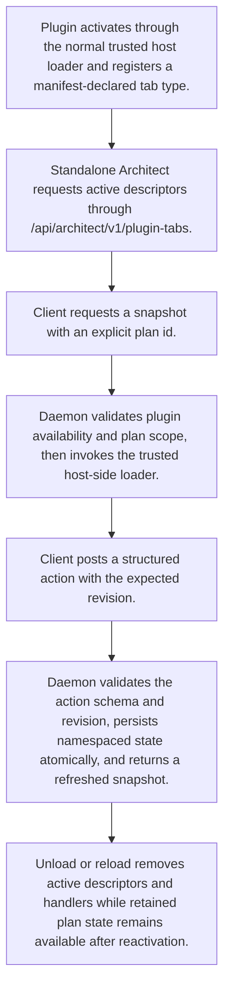

# Architect Plugin Tab Snapshot and Action Dispatch

> Architect Plugin Tab Snapshot and Action Dispatch is a parser-node evidenced from src/plugins/architect-contributions.ts, src/plugins/architect-plan-state.ts. Its declared fields, source provenance, and explicit links define how it participates in the project while semantic model output is unavailable. This evidence-only account is intentionally provisional and will be replaced by the next successful LLM enrichment pass.

**Trigger:** Standalone Architect lists a plugin tab, loads a plan snapshot, or posts a structured plugin tab action.  
**Source files:** src/plugins/architect-contributions.ts, src/plugins/architect-plan-state.ts, src/architect/routes.ts, examples/action-checklist/index.js, tests/sdk/architect-routes.test.ts, tests/standalone-architect-routes.test.ts  

## Flowchart

## Steps

### 1. Plugin activates through the normal trusted host loader and registers a manifest-declared tab type.

### 2. Standalone Architect requests active descriptors through /api/architect/v1/plugin-tabs.

### 3. Client requests a snapshot with an explicit plan id.

### 4. Daemon validates plugin availability and plan scope, then invokes the trusted host-side loader.

### 5. Client posts a structured action with the expected revision.

### 6. Daemon validates the action schema and revision, persists namespaced state atomically, and returns a refreshed snapshot.

### 7. Unload or reload removes active descriptors and handlers while retained plan state remains available after reactivation.

