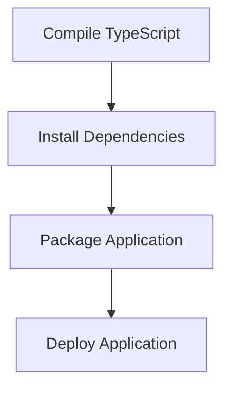

# Build and Deploy Process

> This process automates the building and deployment of the application. It compiles the TypeScript code and prepares the application for production use.

**Trigger:** Build command execution  
**Source files:** package.json, tsconfig.json  

## Flowchart

## Steps

### 1. Compile TypeScript

Use the TypeScript compiler to transpile the code into JavaScript.

### 2. Install Dependencies

Install any necessary dependencies for the application.

### 3. Package Application

Package the application files for deployment.

### 4. Deploy Application

Deploy the packaged application to the specified environment.

