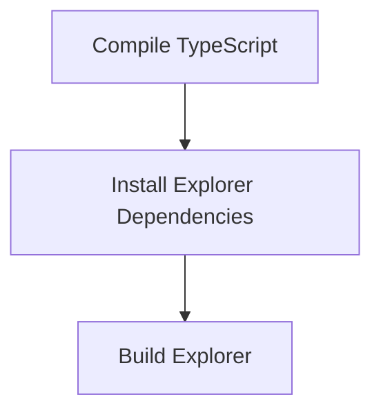

# Build and Deploy Process

> Build and Deploy Process is a parser-node evidenced from package.json, scripts/build.sh. Its declared fields, source provenance, and explicit links define how it participates in the project while semantic model output is unavailable. This evidence-only account is intentionally provisional and will be replaced by the next successful LLM enrichment pass.

**Trigger:** Build command execution  
**Source files:** package.json, scripts/build.sh  

## Flowchart

## Steps

### 1. Compile TypeScript

Run the TypeScript compiler to convert TypeScript files to JavaScript.

### 2. Install Explorer Dependencies

Install necessary dependencies for the explorer component.

### 3. Build Explorer

Compile the explorer component for deployment.

