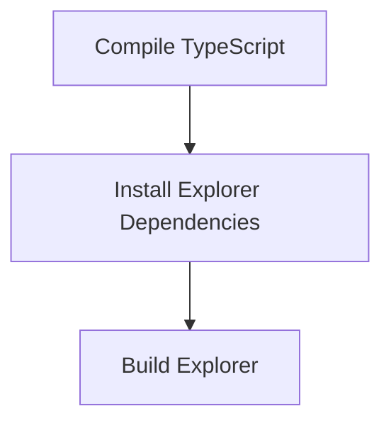

# Build and Deploy Process

> This process compiles the TypeScript code and prepares the application for deployment. It includes building both the server and the explorer components.

**Trigger:** Build command execution  
**Source files:** package.json, scripts/build.sh  

## Flowchart

## Steps

### 1. Compile TypeScript

Run the TypeScript compiler to convert TypeScript files to JavaScript.

### 2. Install Explorer Dependencies

Install necessary dependencies for the explorer component.

### 3. Build Explorer

Compile the explorer component for deployment.

