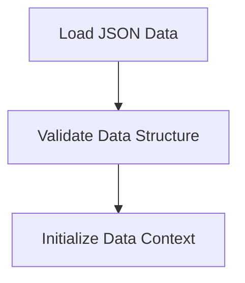

# Data Loading Process

> Data Loading Process is a parser-node evidenced from src/api/routes.ts, src/instance/index.ts. Its declared fields, source provenance, and explicit links define how it participates in the project while semantic model output is unavailable. This evidence-only account is intentionally provisional and will be replaced by the next successful LLM enrichment pass.

**Trigger:** Server initialization  
**Source files:** src/api/routes.ts, src/instance/index.ts  

## Flowchart

## Steps

### 1. Load JSON Data

Read and parse the required JSON data files into memory.

### 2. Validate Data Structure

Ensure the loaded data conforms to expected schemas.

### 3. Initialize Data Context

Set up the context for data usage throughout the application.

