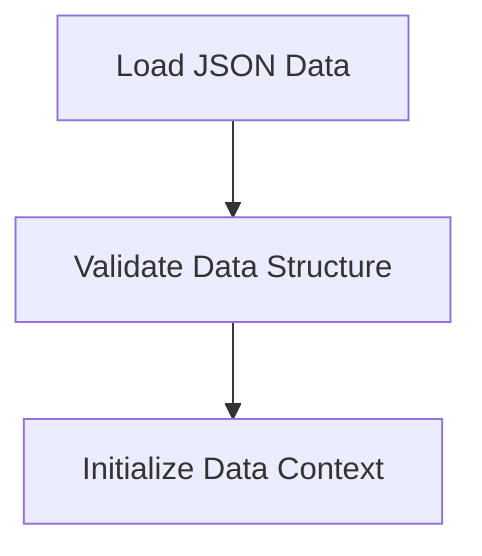

# Data Loading Process

> This process handles the loading of various data files necessary for the application to function correctly. It ensures that all required data is available before the application begins processing requests.

**Trigger:** Server initialization  
**Source files:** src/api/routes.ts, src/instance/index.ts  

## Flowchart

## Steps

### 1. Load JSON Data

Read and parse the required JSON data files into memory.

### 2. Validate Data Structure

Ensure the loaded data conforms to expected schemas.

### 3. Initialize Data Context

Set up the context for data usage throughout the application.

