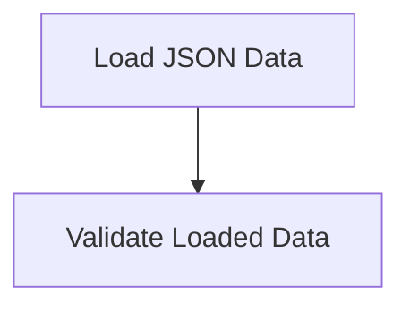

# Data Loading Process

> Data Loading Process is a parser-node evidenced from src/api/routes.ts, src/instance/index.ts. Its declared fields, source provenance, and explicit links define how it participates in the project while semantic model output is unavailable. This evidence-only account is intentionally provisional and will be replaced by the next successful LLM enrichment pass.

**Trigger:** Server startup  
**Source files:** src/api/routes.ts, src/instance/index.ts  

## Flowchart

## Steps

### 1. Load JSON Data

Load configuration and data files from the specified directory.

### 2. Validate Loaded Data

Ensure that the loaded data conforms to expected schemas and structures.

