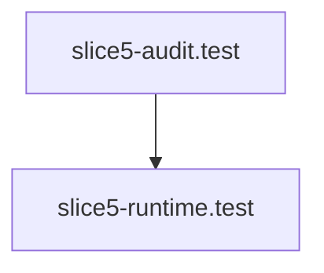

# Test Flow

> Test Flow is a parser-node evidenced from extensions/vscode/src/test/slice5-audit.test.ts, extensions/vscode/src/test/slice5-runtime.test.ts. Its declared fields, source provenance, and explicit links define how it participates in the project while semantic model output is unavailable. This evidence-only account is intentionally provisional and will be replaced by the next successful LLM enrichment pass.

**Trigger:** Source: extensions/vscode/src/test/slice5-audit.test.ts  
**Source files:** extensions/vscode/src/test/slice5-audit.test.ts, extensions/vscode/src/test/slice5-runtime.test.ts  

## Flowchart

## Steps

### 1. slice5-audit.test

Implemented in extensions/vscode/src/test/slice5-audit.test.ts

### 2. slice5-runtime.test

Implemented in extensions/vscode/src/test/slice5-runtime.test.ts

