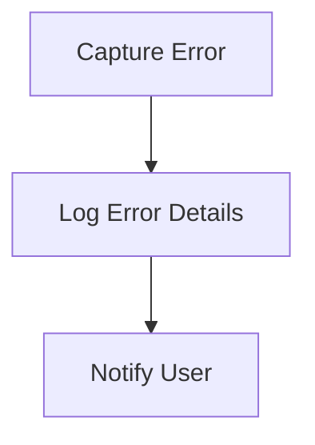

# Error Handling Flow

> This flow manages errors that occur during application execution. It ensures that errors are logged and appropriate feedback is provided to users.

**Trigger:** Error occurrence in the application  
**Source files:** src/utils/logger.ts  

## Flowchart

## Steps

### 1. Capture Error

Detect and capture the error as it occurs.

### 2. Log Error Details

Record the error details for debugging purposes.

### 3. Notify User

Provide feedback to the user regarding the error.

