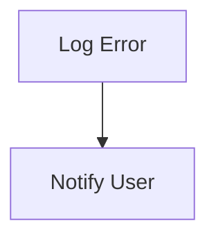

# Error Handling Flow

> This workflow manages errors that occur within the application, ensuring that they are logged and communicated to the user appropriately.

**Trigger:** Error occurrence  
**Source files:** src/utils/logger.ts  

## Flowchart

## Steps

### 1. Log Error

Log the error details for debugging purposes.

### 2. Notify User

Provide feedback to the user regarding the error.

