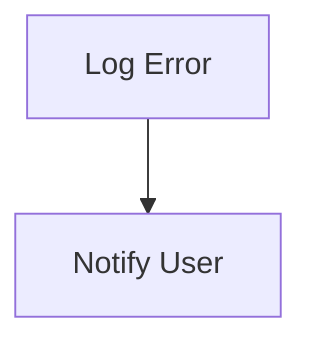

# Error Handling Flow

> Error Handling Flow is a parser-node evidenced from src/utils/logger.ts. Its declared fields, source provenance, and explicit links define how it participates in the project while semantic model output is unavailable. This evidence-only account is intentionally provisional and will be replaced by the next successful LLM enrichment pass.

**Trigger:** Error occurrence  
**Source files:** src/utils/logger.ts  

## Flowchart

## Steps

### 1. Log Error

Log the error details for debugging purposes.

### 2. Notify User

Provide feedback to the user regarding the error.

