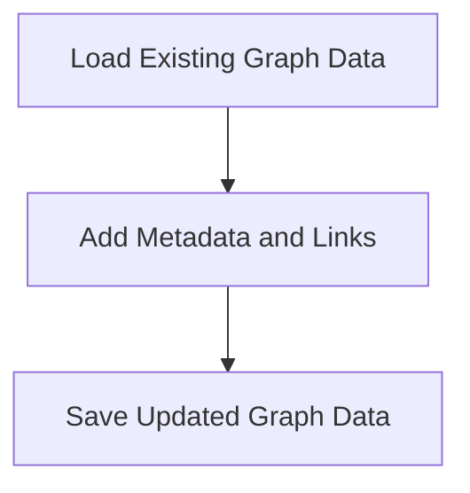

# Graph Enrichment Process

> This process enhances the knowledge graph by adding additional metadata, keywords, and links between entities. It improves the cognitive engine's ability to reason and generate insights.

**Trigger:** Graph data update  
**Source files:** scripts/enrich-graph.mjs  

## Flowchart

## Steps

### 1. Load Existing Graph Data

Read the current state of the graph data from files.

### 2. Add Metadata and Links

Insert additional metadata and cross-links into the graph.

### 3. Save Updated Graph Data

Write the enriched graph data back to the files.

