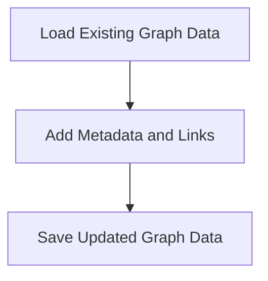

# Graph Enrichment Process

> Graph Enrichment Process is a parser-node evidenced from scripts/enrich-graph.mjs. Its declared fields, source provenance, and explicit links define how it participates in the project while semantic model output is unavailable. This evidence-only account is intentionally provisional and will be replaced by the next successful LLM enrichment pass.

**Trigger:** Graph data update  
**Source files:** scripts/enrich-graph.mjs  

## Flowchart

## Steps

### 1. Load Existing Graph Data

Read the current state of the graph data from files.

### 2. Add Metadata and Links

Insert additional metadata and cross-links into the graph.

### 3. Save Updated Graph Data

Write the enriched graph data back to the files.

