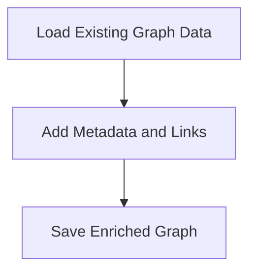

# Graph Enrichment Process

> This process enriches the knowledge graph by adding metadata, links, and keywords to enhance the cognitive capabilities of the system.

**Trigger:** Graph enrichment script executed  
**Source files:** scripts/enrich-graph.mjs  

## Flowchart

## Steps

### 1. Load Existing Graph Data

Read existing graph data from files.

### 2. Add Metadata and Links

Insert additional metadata and cross-links into the graph.

### 3. Save Enriched Graph

Write the enriched graph data back to the files.

