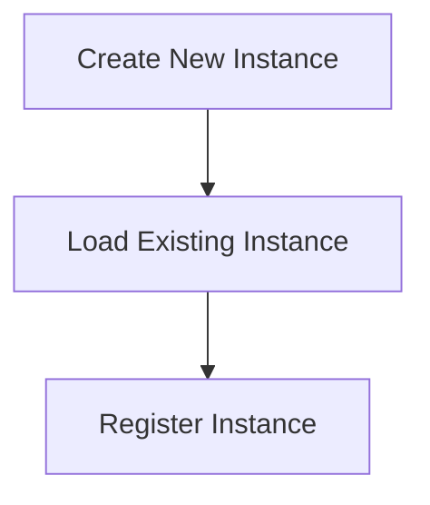

# Instance Management Process

> Instance Management Process is a parser-node evidenced from src/instance/index.ts. Its declared fields, source provenance, and explicit links define how it participates in the project while semantic model output is unavailable. This evidence-only account is intentionally provisional and will be replaced by the next successful LLM enrichment pass.

**Trigger:** Instance command  
**Source files:** src/instance/index.ts  

## Flowchart

## Steps

### 1. Create New Instance

Initialize a new instance with default settings.

### 2. Load Existing Instance

Load an instance from persistent storage.

### 3. Register Instance

Add the instance to the application registry for management.

