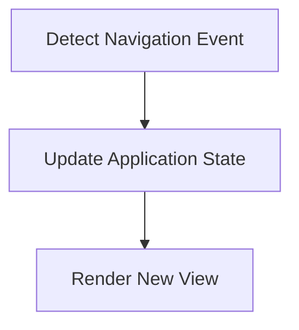

# Navigation Flow

> This workflow handles the navigation within the DreamGraph application, allowing users to move between different views and components seamlessly.

**Trigger:** User navigates through the application  
**Source files:** explorer/src/App.tsx  

## Flowchart

## Steps

### 1. Detect Navigation Event

Listen for user navigation events within the application.

### 2. Update Application State

Update the application state based on the user's navigation choice.

### 3. Render New View

Render the appropriate view based on the updated application state.

