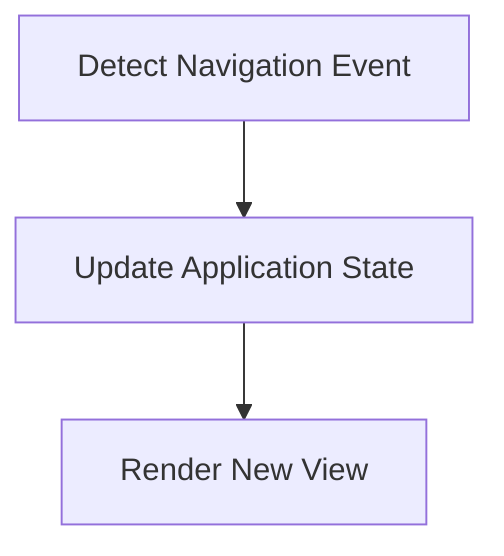

# Navigation Flow

> Navigation Flow is a parser-node evidenced from explorer/src/App.tsx. Its declared fields, source provenance, and explicit links define how it participates in the project while semantic model output is unavailable. This evidence-only account is intentionally provisional and will be replaced by the next successful LLM enrichment pass.

**Trigger:** User navigates through the application  
**Source files:** explorer/src/App.tsx  

## Flowchart

## Steps

### 1. Detect Navigation Event

Listen for user navigation events within the application.

### 2. Update Application State

Update the application state based on the user's navigation choice.

### 3. Render New View

Render the appropriate view based on the updated application state.

