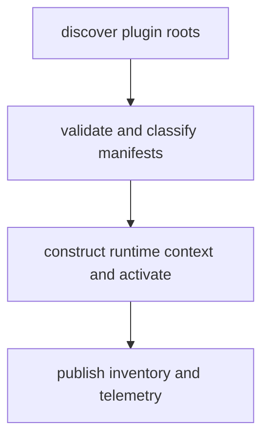

# Plugin Discovery Process

> DreamGraph v9.0.0 active plugin discovery and load workflow triggered during application/server startup. The host scans configured plugin roots, validates manifests, evaluates trust/enablement state, constructs authoritative runtime PluginContext instances for accepted plugins, activates eligible plugins, and records inventory/telemetry. This workflow is shipped behavior, not a future host-loading roadmap item.

**Trigger:** Application or server startup  
**Source files:** src/plugins/manager.ts, src/cli/commands/plugin.ts, docs/live-docs/workflows/_index.md, docs/site/workflows/_index.md, docs/sdk/plugin-developer-guide/10-lifecycle-and-installation.md  

## Flowchart

## Steps

### 1. discover plugin roots

Enumerate configured plugin directories and candidate manifests.

### 2. validate and classify manifests

Validate plugin metadata and determine trust/enablement eligibility.

### 3. construct runtime context and activate

Build authoritative PluginContext instances for accepted plugins and call activation for eligible entries.

### 4. publish inventory and telemetry

Expose plugin state through inventory/introspection surfaces and runtime events.

