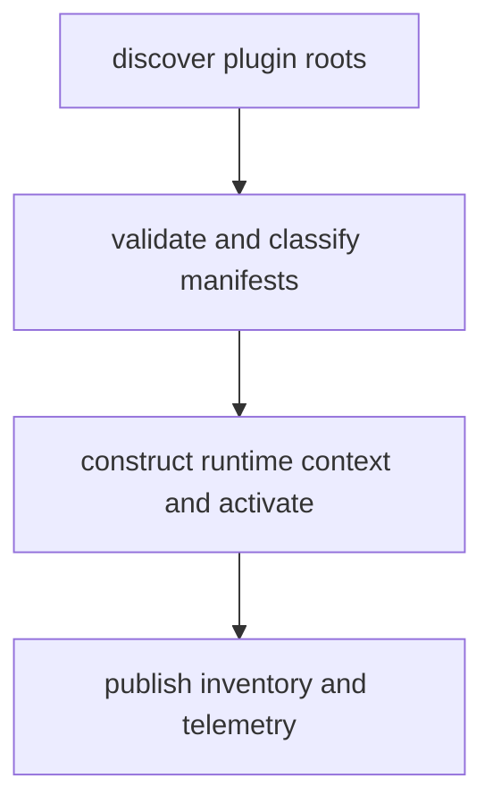

# Plugin Discovery Process

> Plugin Discovery Process is a parser-node evidenced from src/plugins/manager.ts, src/cli/commands/plugin.ts. Its declared fields, source provenance, and explicit links define how it participates in the project while semantic model output is unavailable. This evidence-only account is intentionally provisional and will be replaced by the next successful LLM enrichment pass.

**Trigger:** Application or server startup  
**Source files:** src/plugins/manager.ts, src/cli/commands/plugin.ts, docs/live-docs/workflows/_index.md, docs/site/workflows/_index.md, docs/sdk/plugin-developer-guide/10-lifecycle-and-installation.md  

## Flowchart

## Steps

### 1. discover plugin roots

Enumerate configured plugin directories and candidate manifests.

### 2. validate and classify manifests

Validate plugin metadata and determine trust/enablement eligibility.

### 3. construct runtime context and activate

Build authoritative PluginContext instances for accepted plugins and call activation for eligible entries.

### 4. publish inventory and telemetry

Expose plugin state through inventory/introspection surfaces and runtime events.

