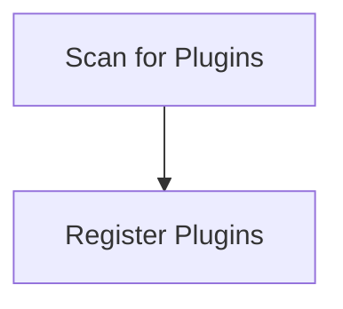

# Plugin Discovery Process

> Plugin Discovery Process is a parser-node evidenced from src/discipline/register.ts. Its declared fields, source provenance, and explicit links define how it participates in the project while semantic model output is unavailable. This evidence-only account is intentionally provisional and will be replaced by the next successful LLM enrichment pass.

**Trigger:** Server startup  
**Source files:** src/discipline/register.ts  

## Flowchart

## Steps

### 1. Scan for Plugins

Search the extensions directory for available plugins.

### 2. Register Plugins

Register discovered plugins with the application.

