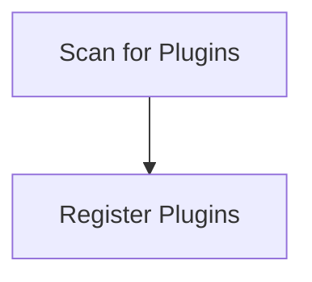

# Plugin Discovery Process

> This process identifies and loads available plugins/extensions for the DreamGraph application. It ensures that all necessary plugins are registered and ready for use.

**Trigger:** Server startup  
**Source files:** src/discipline/register.ts  

## Flowchart

## Steps

### 1. Scan for Plugins

Search the extensions directory for available plugins.

### 2. Register Plugins

Register discovered plugins with the application.

