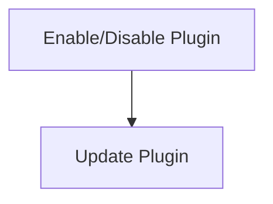

# Plugin Management Process

> Plugin Management Process is a parser-node evidenced from src/discipline/tools.ts. Its declared fields, source provenance, and explicit links define how it participates in the project while semantic model output is unavailable. This evidence-only account is intentionally provisional and will be replaced by the next successful LLM enrichment pass.

**Trigger:** User modifies plugin settings  
**Source files:** src/discipline/tools.ts  

## Flowchart

## Steps

### 1. Enable/Disable Plugin

Change the status of a plugin based on user input.

### 2. Update Plugin

Fetch and apply updates for the enabled plugins.

