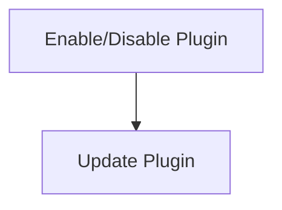

# Plugin Management Process

> This workflow handles the enabling, disabling, and updating of plugins within the DreamGraph application, allowing users to manage their extensions effectively.

**Trigger:** User modifies plugin settings  
**Source files:** src/discipline/tools.ts  

## Flowchart

## Steps

### 1. Enable/Disable Plugin

Change the status of a plugin based on user input.

### 2. Update Plugin

Fetch and apply updates for the enabled plugins.

