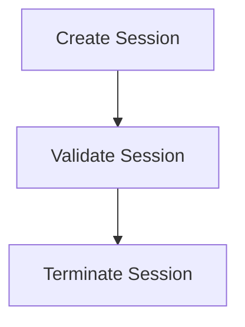

# Session Management Process

> This workflow manages user sessions, including creating, validating, and terminating sessions as users interact with the application.

**Trigger:** User logs in or out  
**Source files:** src/discipline/session.ts  

## Flowchart

## Steps

### 1. Create Session

Establish a new session for the user upon login.

### 2. Validate Session

Check the validity of the current session during user interactions.

### 3. Terminate Session

End the user's session upon logout.

