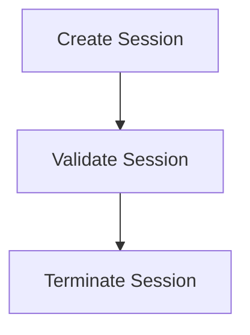

# Session Management Process

> Session Management Process is a parser-node evidenced from src/discipline/session.ts. Its declared fields, source provenance, and explicit links define how it participates in the project while semantic model output is unavailable. This evidence-only account is intentionally provisional and will be replaced by the next successful LLM enrichment pass.

**Trigger:** User logs in or out  
**Source files:** src/discipline/session.ts  

## Flowchart

## Steps

### 1. Create Session

Establish a new session for the user upon login.

### 2. Validate Session

Check the validity of the current session during user interactions.

### 3. Terminate Session

End the user's session upon logout.

