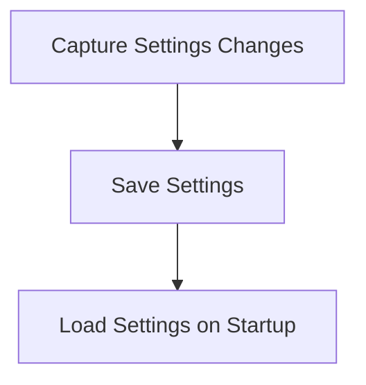

# Settings Persistence Flow

> Settings Persistence Flow is a parser-node evidenced from src/config/config.ts. Its declared fields, source provenance, and explicit links define how it participates in the project while semantic model output is unavailable. This evidence-only account is intentionally provisional and will be replaced by the next successful LLM enrichment pass.

**Trigger:** User updates settings  
**Source files:** src/config/config.ts  

## Flowchart

## Steps

### 1. Capture Settings Changes

Detect changes made to user settings.

### 2. Save Settings

Persist the updated settings to a configuration file.

### 3. Load Settings on Startup

Read the saved settings during application startup.

