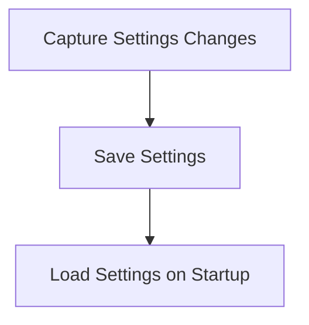

# Settings Persistence Flow

> This flow manages the saving and loading of user settings and configurations. It ensures that user preferences are retained across sessions.

**Trigger:** User updates settings  
**Source files:** src/config/config.ts  

## Flowchart

## Steps

### 1. Capture Settings Changes

Detect changes made to user settings.

### 2. Save Settings

Persist the updated settings to a configuration file.

### 3. Load Settings on Startup

Read the saved settings during application startup.

