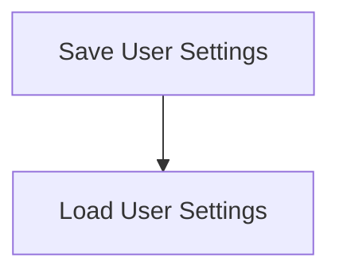

# Settings Persistence Process

> Settings Persistence Process is a parser-node evidenced from src/discipline/session.ts. Its declared fields, source provenance, and explicit links define how it participates in the project while semantic model output is unavailable. This evidence-only account is intentionally provisional and will be replaced by the next successful LLM enrichment pass.

**Trigger:** User updates settings  
**Source files:** src/discipline/session.ts  

## Flowchart

## Steps

### 1. Save User Settings

Persist user settings to the local storage or configuration files.

### 2. Load User Settings

Retrieve user settings from the local storage or configuration files.

