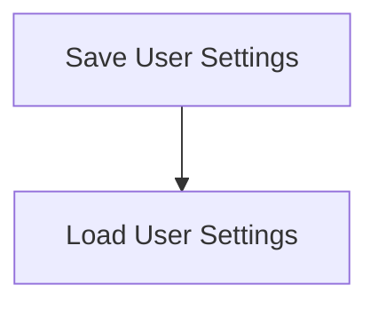

# Settings Persistence Process

> This workflow manages the saving and loading of user settings within the application. It ensures that user preferences are stored and retrieved correctly.

**Trigger:** User updates settings  
**Source files:** src/discipline/session.ts  

## Flowchart

## Steps

### 1. Save User Settings

Persist user settings to the local storage or configuration files.

### 2. Load User Settings

Retrieve user settings from the local storage or configuration files.

