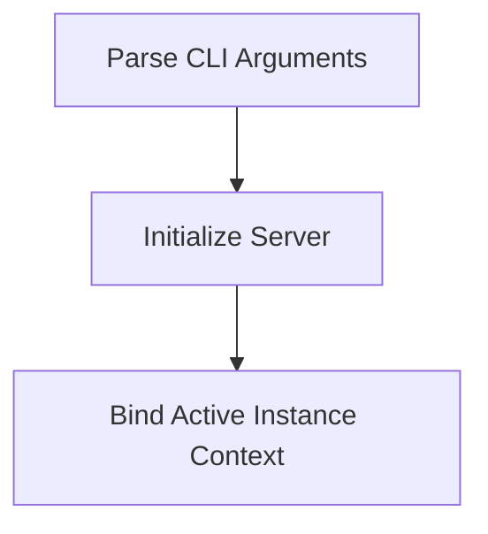

# Startup Initialization Process

> This process initializes the DreamGraph server, setting up the necessary configurations and starting the server based on the specified transport mode. It also handles command-line arguments for configuration.

**Trigger:** Server start command  
**Source files:** src/index.ts  

## Flowchart

## Steps

### 1. Parse CLI Arguments

Parse the command-line arguments to determine the transport mode and port.

### 2. Initialize Server

Create and configure the server based on the parsed arguments.

### 3. Bind Active Instance Context

Resolve the active instance through the MCP/daemon runtime and bind cache, path, and mutex resolvers to the instance-scoped store. Project workflows query runtime knowledge through MCP resources instead of reading server data files directly.

