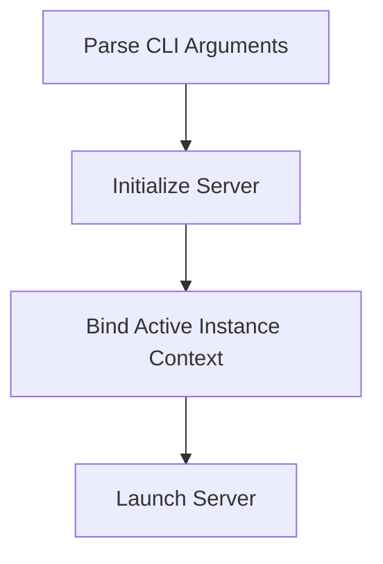

# Startup Process

> This process initializes the DreamGraph MCP Server, setting up the necessary configurations and starting the server. It can operate in either stdio or HTTP transport modes based on user input.

**Trigger:** Server launch via CLI command  
**Source files:** src/index.ts  

## Flowchart

## Steps

### 1. Parse CLI Arguments

Extract transport mode and port from command line arguments.

### 2. Initialize Server

Create and configure the server instance based on the parsed arguments.

### 3. Bind Active Instance Context

Resolve the active instance through the MCP/daemon runtime and bind cache, path, and mutex resolvers to the instance-scoped store. Project workflows query runtime knowledge through MCP resources instead of reading server data files directly.

### 4. Launch Server

Start the server to listen for incoming requests.

