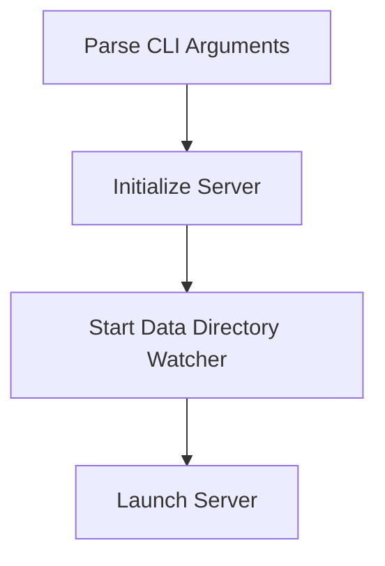

# Startup Process

> Startup Process is a parser-node evidenced from src/index.ts. Its declared fields, source provenance, and explicit links define how it participates in the project while semantic model output is unavailable. This evidence-only account is intentionally provisional and will be replaced by the next successful LLM enrichment pass.

**Trigger:** Server launch via CLI command  
**Source files:** src/index.ts  

## Flowchart

## Steps

### 1. Parse CLI Arguments

Extract transport mode and port from command line arguments.

### 2. Initialize Server

Create and configure the server instance based on the parsed arguments.

### 3. Start Data Directory Watcher

Begin monitoring the data directory for changes.

### 4. Launch Server

Start the server to listen for incoming requests.

