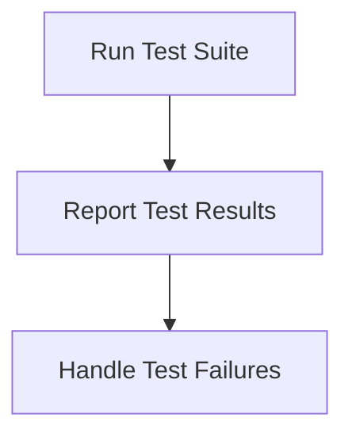

# Testing Process

> This process runs automated tests to ensure the application functions as expected. It verifies that changes do not introduce regressions.

**Trigger:** Test command execution  
**Source files:** tests/**/*.test.ts  

## Flowchart

## Steps

### 1. Run Test Suite

Execute all defined test cases against the application.

### 2. Report Test Results

Collect and display the results of the test execution.

### 3. Handle Test Failures

Log failures and provide feedback for debugging.

