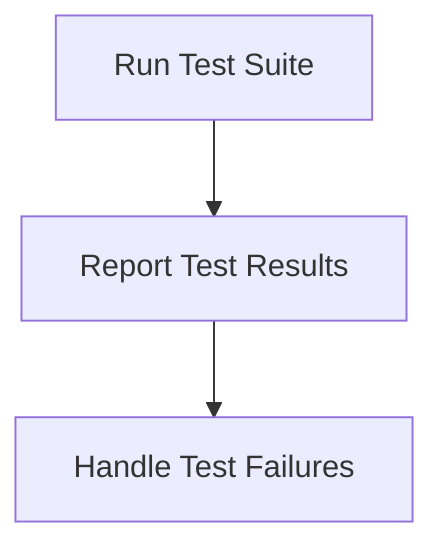

# Testing Process

> Testing Process is a parser-node evidenced from tests/**/*.test.ts. Its declared fields, source provenance, and explicit links define how it participates in the project while semantic model output is unavailable. This evidence-only account is intentionally provisional and will be replaced by the next successful LLM enrichment pass.

**Trigger:** Test command execution  
**Source files:** tests/**/*.test.ts  

## Flowchart

## Steps

### 1. Run Test Suite

Execute all defined test cases against the application.

### 2. Report Test Results

Collect and display the results of the test execution.

### 3. Handle Test Failures

Log failures and provide feedback for debugging.

