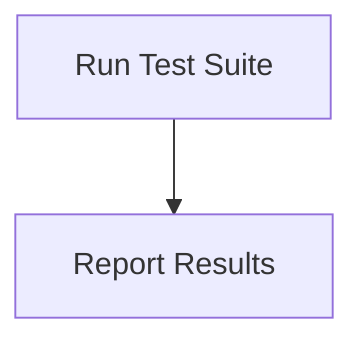

# Testing Process

> Testing Process is a parser-node evidenced from tests/cognitive-producers.test.ts. Its declared fields, source provenance, and explicit links define how it participates in the project while semantic model output is unavailable. This evidence-only account is intentionally provisional and will be replaced by the next successful LLM enrichment pass.

**Trigger:** Test command executed  
**Source files:** tests/cognitive-producers.test.ts  

## Flowchart

## Steps

### 1. Run Test Suite

Execute the defined test cases against the application.

### 2. Report Results

Output the results of the tests, indicating pass/fail status.

