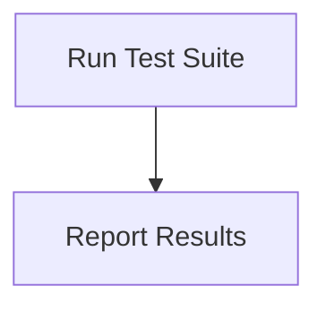

# Testing Process

> This process runs automated tests to ensure the functionality and reliability of the application. It verifies that the application behaves as expected.

**Trigger:** Test command executed  
**Source files:** tests/cognitive-producers.test.ts  

## Flowchart

## Steps

### 1. Run Test Suite

Execute the defined test cases against the application.

### 2. Report Results

Output the results of the tests, indicating pass/fail status.

