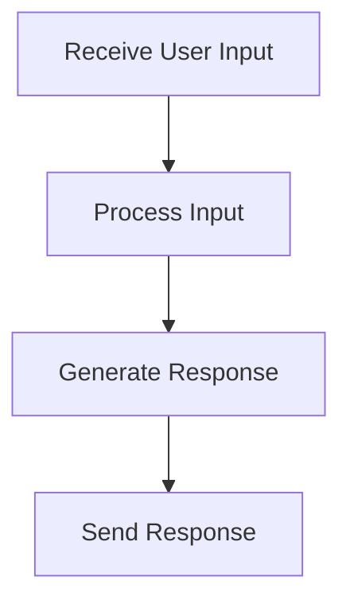

# User Interaction Flow

> This flow manages user interactions with the application, including handling requests and responses. It ensures that user inputs are processed correctly and appropriate outputs are generated.

**Trigger:** User input via CLI or HTTP request  
**Source files:** src/api/routes.ts, src/cognitive/engine.ts  

## Flowchart

## Steps

### 1. Receive User Input

Capture input from the user through the CLI or HTTP request.

### 2. Process Input

Analyze and process the user input to determine the appropriate action.

### 3. Generate Response

Create a response based on the processed input.

### 4. Send Response

Return the generated response to the user.

