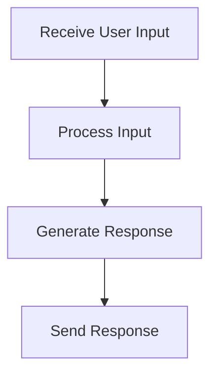

# User Interaction Flow

> User Interaction Flow is a parser-node evidenced from src/api/routes.ts, src/cognitive/engine.ts. Its declared fields, source provenance, and explicit links define how it participates in the project while semantic model output is unavailable. This evidence-only account is intentionally provisional and will be replaced by the next successful LLM enrichment pass.

**Trigger:** User input via CLI or HTTP request  
**Source files:** src/api/routes.ts, src/cognitive/engine.ts  

## Flowchart

## Steps

### 1. Receive User Input

Capture input from the user through the CLI or HTTP request.

### 2. Process Input

Analyze and process the user input to determine the appropriate action.

### 3. Generate Response

Create a response based on the processed input.

### 4. Send Response

Return the generated response to the user.

