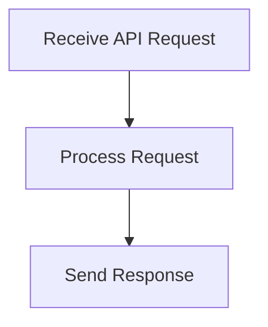

# User Interaction Flow

> This workflow manages user interactions with the DreamGraph application, including handling API requests and responses. It ensures that user commands are processed correctly.

**Trigger:** User API request  
**Source files:** src/api/routes.ts, explorer/src/api.ts  

## Flowchart

## Steps

### 1. Receive API Request

Listen for incoming API requests from users.

### 2. Process Request

Handle the request based on the specified endpoint and parameters.

### 3. Send Response

Return the appropriate response to the user.

