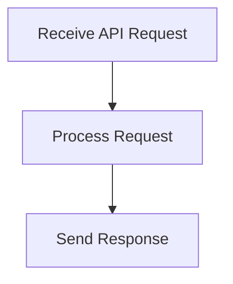

# User Interaction Flow

> User Interaction Flow is a parser-node evidenced from src/api/routes.ts, explorer/src/api.ts. Its declared fields, source provenance, and explicit links define how it participates in the project while semantic model output is unavailable. This evidence-only account is intentionally provisional and will be replaced by the next successful LLM enrichment pass.

**Trigger:** User API request  
**Source files:** src/api/routes.ts, explorer/src/api.ts  

## Flowchart

## Steps

### 1. Receive API Request

Listen for incoming API requests from users.

### 2. Process Request

Handle the request based on the specified endpoint and parameters.

### 3. Send Response

Return the appropriate response to the user.

