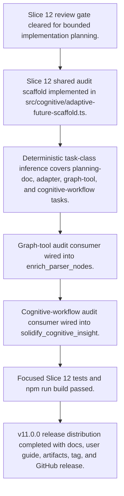

# Adaptive Future Engine Slice Rollout

> Adaptive Future Engine Slice Rollout is a parser-node evidenced from plans/ADAPTIVE_FUTURE_ENGINE_IMPLEMENTATION_SLICES.md, plans/ADAPTIVE_FUTURE_ENGINE_IMPLEMENTATION_LOG.md. Its declared fields, source provenance, and explicit links define how it participates in the project while semantic model output is unavailable. This evidence-only account is intentionally provisional and will be replaced by the next successful LLM enrichment pass.

**Trigger:**   
**Source files:** plans/ADAPTIVE_FUTURE_ENGINE_IMPLEMENTATION_SLICES.md, plans/ADAPTIVE_FUTURE_ENGINE_IMPLEMENTATION_LOG.md, src/cognitive/adaptive-future-scaffold.ts, src/tools/enrich-parser-nodes.ts, src/tools/solidify-insight.ts, docs/adaptive-future-engine.md, guide/14-adaptive-future-engine.md, RELEASE_NOTES_v11.0.0.md  

## Flowchart

## Steps

### 1. Slice 12 review gate cleared for bounded implementation planning.

### 2. Slice 12 shared audit scaffold implemented in src/cognitive/adaptive-future-scaffold.ts.

### 3. Deterministic task-class inference covers planning-doc, adapter, graph-tool, and cognitive-workflow tasks.

### 4. Graph-tool audit consumer wired into enrich_parser_nodes.

### 5. Cognitive-workflow audit consumer wired into solidify_cognitive_insight.

### 6. Focused Slice 12 tests and npm run build passed.

### 7. v11.0.0 release distribution completed with docs, user guide, artifacts, tag, and GitHub release.

