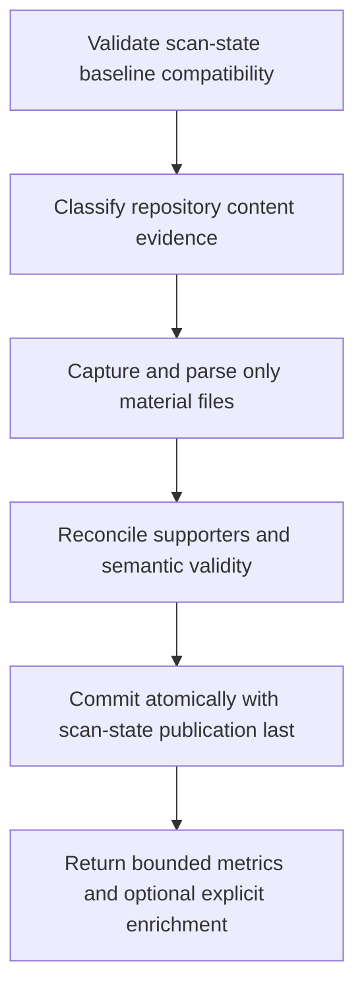

# Incremental Evidence Lifecycle

> Incremental Evidence Lifecycle is a parser-node evidenced from src/tools/scan-project.ts, src/tools/scan-state.ts. Its declared fields, source provenance, and explicit links define how it participates in the project while semantic model output is unavailable. This evidence-only account is intentionally provisional and will be replaced by the next successful LLM enrichment pass.

**Trigger:** Explicit scan_project mode=incremental or dg scan --incremental request after a compatible full baseline  
**Source files:** src/tools/scan-project.ts, src/tools/scan-state.ts, src/tools/incremental-reconciliation.ts, src/tools/graph-health.ts, src/cli/commands/scan.ts, docs/workflows/workflow-project-scan-enrichment.md  

## Flowchart

## Steps

### 1. Validate scan-state baseline compatibility

### 2. Classify repository content evidence

### 3. Capture and parse only material files

### 4. Reconcile supporters and semantic validity

### 5. Commit atomically with scan-state publication last

### 6. Return bounded metrics and optional explicit enrichment

