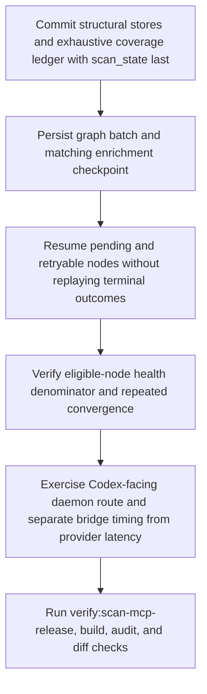

# Scan Completion and MCP Performance Remediation

> Production workflow that publishes scan coverage, checkpoints enrichment after bounded progress, resumes unfinished nodes only, computes eligible health debt, and verifies deterministic plus live Codex/daemon transport behavior under ADR-237/238/239.

**Trigger:** Committed scan, enrichment continuation, or Codex/daemon MCP invocation  
**Source files:** plans/scan-completion-mcp-performance.md, src/tools/scan-project.ts, src/tools/enrich-parser-nodes.ts, tests/tools/scan-project-incremental-e2e.test.ts, tests/tools/enrich-parser-nodes.test.ts, scripts/benchmark-scan-mcp.mjs, docs/release-notes.md  

## Flowchart

## Steps

### 1. Commit structural stores and exhaustive coverage ledger with scan_state last

### 2. Persist graph batch and matching enrichment checkpoint

### 3. Resume pending and retryable nodes without replaying terminal outcomes

### 4. Verify eligible-node health denominator and repeated convergence

### 5. Exercise Codex-facing daemon route and separate bridge timing from provider latency

### 6. Run verify:scan-mcp-release, build, audit, and diff checks

