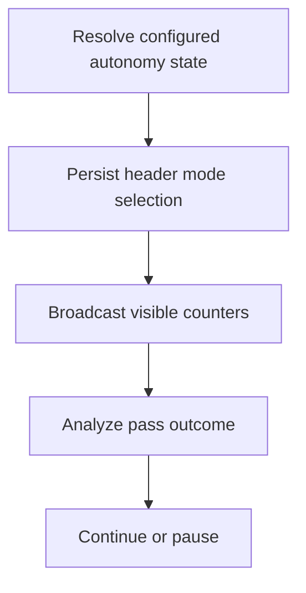

# VS Code Autonomy Continuation Loop

> After each Architect pass, the extension broadcasts visible autonomy status, parses the structured continuation envelope, and may self-continue according to the selected mode and remaining pass/time budget. Header dropdown selections are persisted before later settings-sync paths rebuild autonomy state.

**Trigger:** A user submits an Architect chat turn, selects an autonomy mode from the chat header, or an eligible continuation pass completes.  
**Source files:** extensions/vscode/src/chat-panel.ts, extensions/vscode/src/autonomy-loop.ts, extensions/vscode/src/autonomy.ts, extensions/vscode/src/reporting.ts, extensions/vscode/src/test/slice5-ui.test.ts, docs/workflows/workflow-vscode-autonomy-continuation-loop.md  

## Flowchart

## Steps

### 1. Resolve configured autonomy state

Read dreamgraph.architect.autonomyMode and autoPassBudget into a bounded AutonomyState when settings-sync paths run.

### 2. Persist header mode selection

When the chat header dropdown posts setAutonomyMode, apply that mode's profile, broadcast the new status, and persist the selected mode to configuration before later turns can rebuild from settings.

### 3. Broadcast visible counters

Send autonomyStatus to the webview so the dropdown, mode label, pass budget, and time budget mirror host state.

### 4. Analyze pass outcome

Extract the structured pass envelope and recommended actions from the assistant response.

### 5. Continue or pause

Use mode policy, budget counters, scope, uncertainty, blockers, and user-input signals to decide whether to self-continue or stop for user action.

