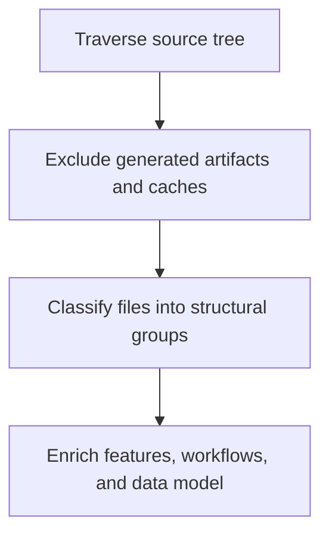

# Project Scan Enrichment

> Deep project scan that classifies source structure and enriches feature, workflow, and data-model seeds from real source areas.

**Trigger:** scan_project invocation  
**Source files:** src/tools/scan-project.ts, src/tools/scanner-artifact-policy.ts, src/tools/structural-generators.ts  

## Flowchart

## Steps

### 1. Traverse source tree

### 2. Exclude generated artifacts and caches

### 3. Classify files into structural groups

### 4. Enrich features, workflows, and data model

## Incremental/additive maintenance

After a successful full scan has published a compatible `dreamgraph.scan_state.v1` baseline, normal repository maintenance may use the same daemon-owned `scan_project` workflow with `mode: "incremental"`. Set `dry_run: true` to classify added, modified, deleted, renamed, and unchanged evidence without parsing, LLM calls, or graph writes. A committed incremental request reparses only added, modified, and unambiguously renamed destinations, reconciles through the instance revision barrier, and leaves enrichment disabled unless `enrich: true` is explicitly requested.

Missing, corrupt, depth/target-incompatible, or repository-set-incompatible baselines fail closed with a full-scan-required result. The operation never silently falls back to a full scan. Deleted evidence withdraws source support and deprecates unsupported entities; ordinary scanning never purges retained knowledge. Full scan remains the recovery authority.